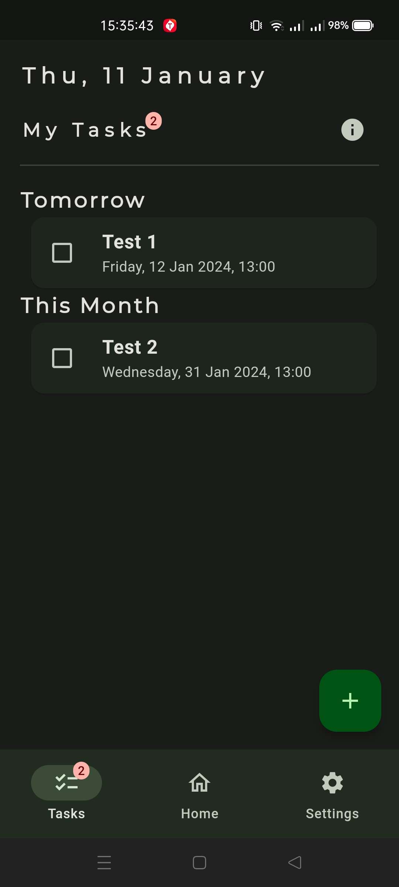
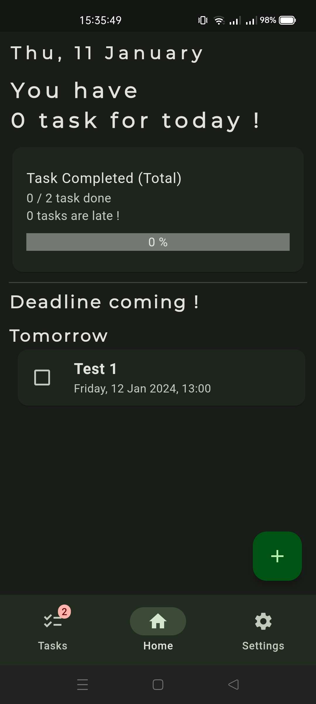
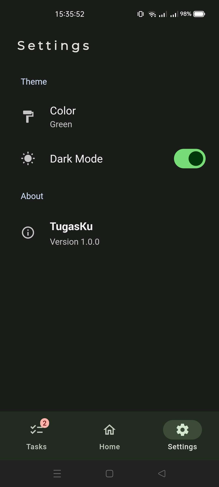

## TugasKu
TugasKu (*'My Tasks'* or *'My Assignments' *in English) is a simple ToDo List app and has a feature that commonly found in ToDo List apps in general. 

I created this app for learning purpose only, especially architecturing a Flutter project.

### What i Used?
- [Flutter](https://flutter.dev/ "Flutter")
- [Realm](https://pub.dev/packages/realm "Realm") and [SharedPreferences](https://pub.dev/packages/shared_preferences "SharedPreferences") for storing database (currently only store locally)
- [Riverpod](https://riverpod.dev/ "Riverpod") for State Management
- [Google Fonts](https://pub.dev/packages/google_fonts "Google Fonts")
- and many more packages.

### Project Structure
- **Core**
- **Database**
- **Model**
- **Notifier**
- **Services**
- **Presentation**

### Flow
- **Updating UI**: 
Widgets updating itself from watching provider (using ref.watch(...)) (lets call it usecase), usecase is watching a notifier and using its state to provide some value (example: `todayTaskCounterProvider` watching `taskViewNotifierProvider` and use its state to provide how many today tasks are. Widgets then watching `todayTaskCounterProvider` to update its UI). 
- **Action**: 
User press a widget -> widget call ref.read(...) to notifier function -> notifier call a services -> services call a database -> database return a data to services then to notifier -> notifier updating its state

### Fonts used
- [Monsterrat](https://fonts.google.com/specimen/Montserrat)
- [Yantramanav](https://fonts.google.com/specimen/Yantramanav)

### TODO
- To create backup feature using Realm Flexible Sync.

## Screenshots
<table>
  <tbody>
    <tr>
      <td></td>
      <td></td>
      <td></td>
    </tr>
  </tbody>
</table>